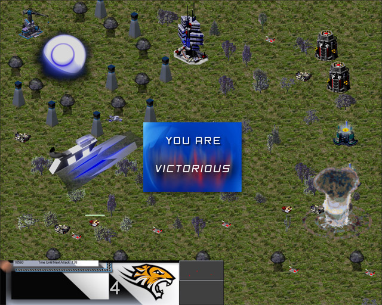



## Rise of Reign \(Update : 17\-July\)

### Description

[See Screenshot] Fasten Your Seat belts for an Ultimate Gaming Experience, First time ever an RTS game in pure VB. No DirectX or OpenGL. Just VB. You can create your own base and make units to defend your base. Move over six missions. 100% Original Formula. Fully modable. You can make custom mods for RoR and also submit on psc :]. Used trigonometry in detail. MapEdit is included which can make/edit maps at ease. With its powerful script engine you can give string commands and use them in your map. Modder is also included. You can edit rules of different weapons, tanks, aircrafts, buildings, Modder is a bit incomplete .Sorry for large size but is is comparitively small. NOTE : USE THIS GAME COMPILED, please vote.

----

Update 1 (17-July)

Made new and realtime textures,

Changed old menu image,

Added Manual for new people,

Changed The Defeat Sign and button image
 
### More Info
 
RoR includes mini but powerful command processor for events and triggers (Used for maps)It splits the command to its name, arguments and brackets.

Every object in the game is called by it's index number

Use commands like,

destunt(index)

Destroys the tank of the index

destbldng(index)

Destroys structure of the index

makebldng(ini as string,side as string,flip as boolean,x as integer,y as integer)

Makes a structure, ini is the name of building, side is the side ('Allies' for user)

flip is the rotation of structure, X &amp; Y are the position of structure.

maketank(ini as string,side as string,x as integer,y as integer,toX as integer,toY as integer)

toX &amp; toY is the destination place of the tank

airmission(dock as integer,side as sting,ini as string,x as integer,y as integer)

Initializes an air mission on ...

dock is index of airfield, X&amp;Y are the target location

nmsl(x as integer,y as integer)

Fires nuclear missile on X and Y

bolt(x as integer,y as integer)

lightning strikes on X and Y

Use strings without quotations

USE EVERY TOOL IN THIS ZIP COMPILED

OSVV Capture is also included. Now you can convert RA2/TS voxels into images and use them in game

firstly download Open Source Voxel Viewer from ppmsite.com

Now open it : Open a voxel or just download it from ppmsite.com forums.

You can also extract RA2/TS voxels by XCC Mixer (Search it in google),(RA2 or TS necessary)

Now Open the voxel : Goto ground tab and uncheck the "Draw Ground".

Also goto Sky and uncheck "Draw Sky" : Goto "Unit" tab and set "Unit Rot" to 0

Now goto View -&gt; Camera Manager : Set 'Y Rot' to 0 and 'depth' to -40

Open 'OSVV Capture' that I made. It is in \OSVV Capture\

Drag the "Grab textbox" button to the "unit rot" textbox in 'Unit' tab and release it

similarly drag 'Get 3D View box' and release it over the 3D viewer of OSVV.

Also with 'Get Window'. drop it over the the window of OSVV.

Now rename 'Artillery' to the name of voxel (eg. Tank , M1)

Just click "Process". Wait till the rotation is complete

Now goto images folder. You will see all the extracted images.

The images extracted will be non transparent bitmaps

Use Adobe Photoshop or any other software to make transparent regions and remove label

If using adobe, Prefer making actions and batch images (it saves time and effort).

The format of image will be of gif and with transparency

The name of file must be

Name &amp; Number &amp; ' copy.gif'

like	Medium Tank1 copy.gif

Number must start from 0 to 20 (complete 360 degree rotation)

Crop the extracted image for best results.

You can now make new units and use them in your custom mod of RoR

The output is the effect of the trigger

To See demo, Press F* and write any of the command.

See 'Trig' Sub in frmmain.

             |
---                |---
**Submitted On**   |2008-07-16 19:04:36
**By**             |[Xelon Labs](https://github.com/Planet-Source-Code/PSCIndex/blob/master/ByAuthor/xelon-labs.md)
**Level**          |Intermediate
**User Rating**    |5.0 (80 globes from 16 users)
**Compatibility**  |VB 4\.0 \(32\-bit\), VB 5\.0, VB 6\.0
**Category**       |[Complete Applications](https://github.com/Planet-Source-Code/PSCIndex/blob/master/ByCategory/complete-applications__1-27.md)
**World**          |[Visual Basic](https://github.com/Planet-Source-Code/PSCIndex/blob/master/ByWorld/visual-basic.md)
**Archive File**   |[Rise\_of\_Re2120837172008\.zip](https://github.com/Planet-Source-Code/xelon-labs-rise-of-reign-update-17-july__1-70809/archive/master.zip)

